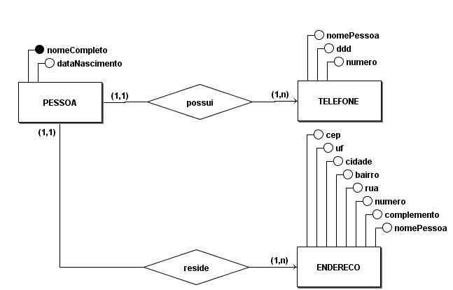
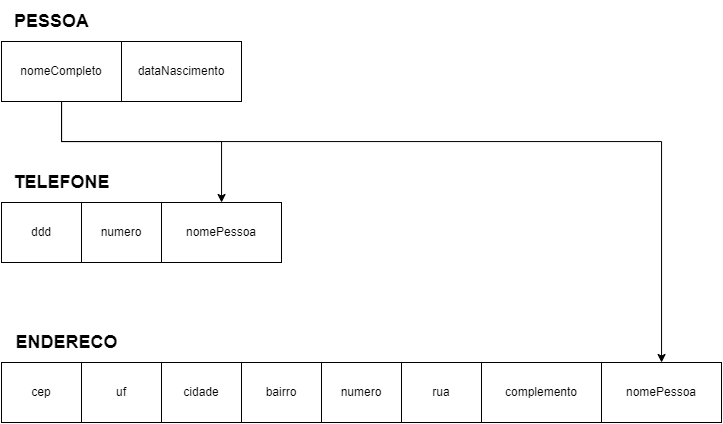

<!--
     METODOLOGIA =>   (primeiro) ME-R =>   (depois) DE-R =>   (finaliza) DE

ENUNCIADO

Existe a necessidade de criação de uma agenda pessoal para uma única pessoa contendo os dados de identificação de cada pessoa cadastrada, seu(s) endereço(s) e telefone(s), parentescos primários (somente cônjuge, filhos e pais) identificados com os dados pessoais (nome e data de nascimento) de cada um destes parentes que serão registrados (armazenados na agenda pessoal).

Respeite as regras para elaboração do ME-R e dos diagramas (DE-R e Diagrama de Esquemas), conforme foi estudado nas últimas aulas.

-->

**Aluno:** Rodrigo Carvalho dos Santos 
**Matrícula:** 180027352 

# AULA 4 EXERCÍCIO 2

## ME-R (Modelo Entidade Relacionamento)

### ENTIDADES:

PESSOA 
ENDERECO 
TELEFONE 

### ATRIBUTOS:

PESSOA(<u>nomeCompleto</u>, dataNascimento) 
ENDERECO(<u>nomeDaPessoa</u>, cep, estado, cidade, bairro, rua, numero, complemento) 
TELEFONE(<u>nomeDaPessoa</u>, ddd, numero) 

### RELACIONAMENTOS:

PESSOA - **possui** - ENDERECO 
Uma PESSOA pode possuir um ou mais ENDERECO 
Cardinalidade: (**1:n**) 

PESSOA - **reside** - TELEFONE 
Uma PESSOA pode possuir um ou mais TELEFONE 
Cardinalidade: (**1:n**) 

<footer></footer>

## DE-R (Diagrama Entidade Relacionamento)

<footer></footer>

## DE

