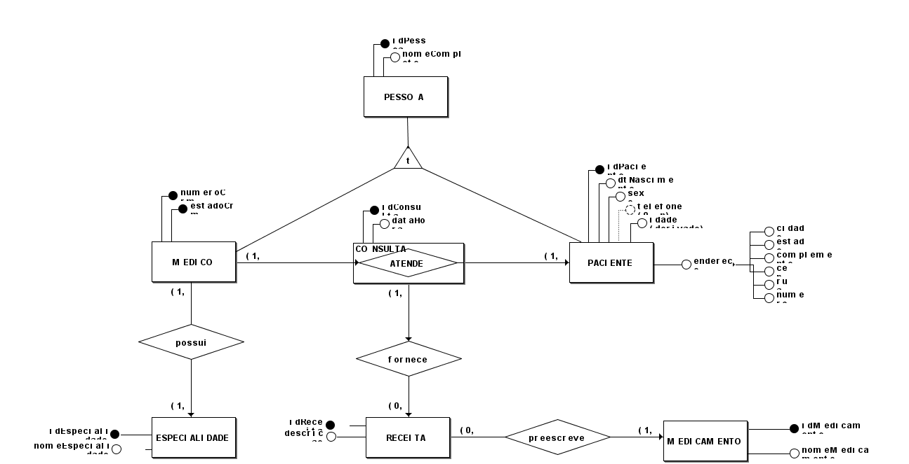
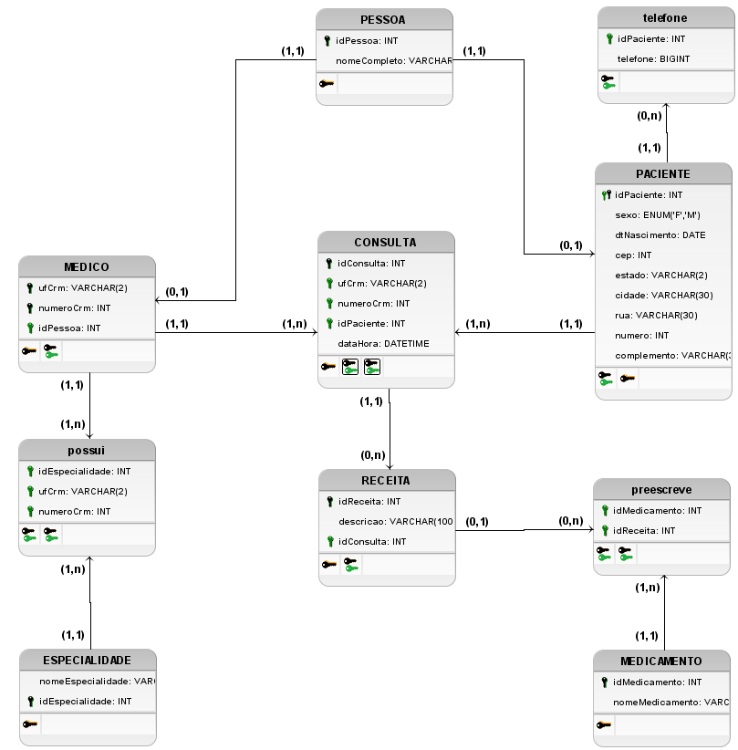

<!--
     METODOLOGIA =>   (primeiro) ME-R =>   (depois) DE-R =>   (finaliza) DLD

ENUNCIADO (original)

Uma clínica médica está preocupada com o receituário que seus médicos estão passando para cada paciente e lhe contratou para elaborar uma base de dados que permita ao coordenador da clínica acompanhar estas receitas médicas fornecidas aos pacientes, evitando possíveis enganos.
Cada médico precisa ser cadastrado com seu CRM (número de inscrição do médico no Conselho Regional de Medicina, que é estadual), nome completo e especialidade clínica, enquanto

Os pacientes serão registrados no banco de dados com nome completo, idade, sexo, telefone(s) e o endereço residencial (só um endereço).

A possível prescrição médica, contida na receita fornecida pelo médico após uma consulta na clínica, deverá conter a data de emissão e o(s) medicamento(s) receitado(s).

-->
**Matrícula:** 180027352 
**Aluno:** Rodrigo Carvalho dos Santos 
# AULA 4 EXERCÍCIO 5 EVOLUÇÃO 4

## ME-R (Modelo Entidade Relacionamento)

### ENTIDADES:
- PESSOA

- MEDICO
- PACIENTE
- RECEITA
- CONSULTA
- MEDICAMENTO
- ESPECIALIDADE

### ATRIBUTOS:

- PESSOA (<u>**idPessoa**</u>, nomeCompleto)
- MEDICO (<u>**numeroCrm**</u>, **ufCrm**, idPessoa)
- PACIENTE (<u>**idPaciente**</u>, idPessoa, dtNascimento, sexo, {telefone(ddd, numero)}, endereco(estado, cidade, cep, complemento))
- CONSULTA (<u>**idConsulta**</u>, numeroCrm, ufCrm, idPaciente, dtHora)
- RECEITA (<u>**idReceita**</u>, descricao, idConsulta)
- MEDICAMENTO (<u>**idMedicamento**</u>, nomeMedicamento)
- ESPECIALIDADE (<u>**idEspecialidade**</u>, nomeEspecialidade)

### RELACIONAMENTOS:

- **MEDICO** - atende - **PACIENTE**
    -   um **MEDICO** pode atender um ou vários **PACIENTE**, enquanto um **PACIENTE** pode ser atendido por um ou vários **MEDICO**.
    -   Relacionamento (**n:m**)
- **MEDICO** – possui – **ESPECIALIDADE**
    -   um **MEDICO** possui uma ou várias **ESPECIALIDADE**, enquanto uma **ESPECIALIDADE** pode ser possuída por um ou vários **MEDICO**.
    -   Relacionamento (**n:m**)
- **CONSULTA** - fornece - **RECEITA**
    -   uma **CONSULTA** pode fornecer nenhuma ou várias **RECEITA**, enquanto uma **RECEITA** pode ser fornecida por apenas uma **CONSULTA**.
    -   Relacionamento (**1:n**)
- **RECEITA** - prescreve - **MEDICAMENTO**
    -   uma **RECEITA** pode prescrever um ou vários **MEDICAMENTO**, enquanto uma **MEDICAMENTO** pode ser prescrito por uma ou várias **RECEITA**.
    -   Relacionamento (**n:m**)

<footer>Brasília UnB-Gama</footer>

## DE-R (Diagrama Entidade Relacionamento)

<footer>Brasília UnB-Gama</footer>

## DE

<footer>Brasília UnB-Gama</footer>
