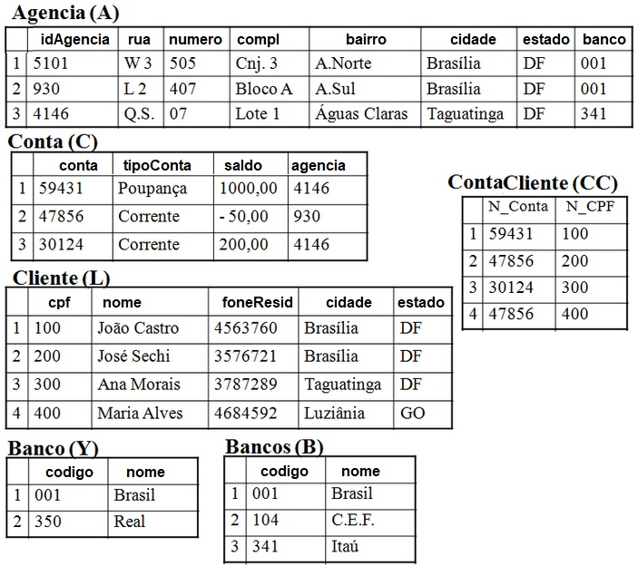

 

Disciplina: Sistema de Banco de Dados 1

Turma:A-1-2023

Professor: Vandor Roberto Vilardi Rissoli

Aluno: Rodrigo Carvalho dos Santos

Matrícula: 18/0027352

 

# Aula 9 Exercício 2

<footer>Brasília UnB-Gama</footer>

a) (B ∪ Y):

codigo | nome
-|-
001 | Brasil
104 | C.E.F.
341 | Itaú
350 | Real

b) (B ∩ Y):

codigo | nome
-|-
001 | Brasil

c) (B - Y):

codigo | nome
-|-
104 | C.E.F.
341 | Itaú

c) (Y - B):

codigo | nome
-|-
350 | Real

d) (B x Y):

codigo | nome | codigo | nome
-|-|-|-
001 | Brasil | 001 | Brasil
001 | Brasil | 350 | Real
104 | C.E.F. | 001 | Brasil
104 | C.E.F. | 350 | Real
341 | Itaú   | 001 | Brasil
341 | Itaú   | 350 | Real

e) π idAgencia, cidade, estado (A):

idAgencia | cidade | estado
-|-|-
5101 | Brasília   | DF
930  | Brasília   | DF
4146 | Taguatinga | DF

f) σ [ cidade = “Brasilia” ] (L):

cpf | nome | foneResid | cidade | estado
-|-|-|-|-
100 | João Castro | 4563760 | Brasília   | DF
200 | José Sechi  | 3576721 | Brasília   | DF

g) Θ [ agencia = idAgencia ] (C, A):

conta | tipoConta | saldo | agencia | idAgencia | rua | numero | compl | bairro | cidade | estado | banco
-|-|-|-|-|-|-|-|-|-|-|-
59431 | Poupança | 1000,00 | 4146 | 4146 | Q.S | 07  | Lote 1  | Águas Claras | Taguatinga | DF | 341
30124 | Corrente | 200,00  | 4146 | 4146 | W 3 | 505 | Cnj. 3  | A.Norte      | Brasília   | DF | 001
47856 | Corrente | -50,00  | 930  | 930  | L 2 | 407 | Bloco A | A.Sul        | Brasília   | DF | 001

h) π agencia, tipoConta, cidade ( σ [ saldo >= 0 ] ( Θ [ agencia = idAgencia ] (C, A) ) ):

agencia | tipoConta | cidade
-|-|-
4146 | Poupança | Taguatinga
4146 | Corrente | Brasília

i) π nome, saldo, estado ( σ [ estado != “DF” ] ( Θ [ cpf = nCpf ] ( L, Θ [ conta = nConta ] (C, CC) ) ) :

nome | saldo | estado
-|-|-
Maria Alves | -50,00 | GO

j) π nome, foneResid, conta, saldo (σ [ saldo < 0 ] (σ [ cidade = “Brasilia” ] ( L, Θ [ conta = nConta ] (C, CC) )))

nome | foneResid | conta | saldo
-|-|-|-
